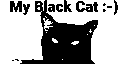

# Convert animated gif & videos for ssd1306-like OLED panel :rainbow: :sparkles:
The goal of this github repo is to offer Python :snake: scripts for **converting animated gif, still pictures (gif, jpeg, png...) and videos (mp4, webm...) in the ssd1306-like OLED panel format, with an optional zlib compression**. You will also find **MicroPython :snake: examples** for demonstrating on a "real case" how to use the converted images...

The ssd1306 OLED panel is pretty famous on Arduino/Nucleo-based electronic devices, like on the [AlphaBot2-Ar](https://www.waveshare.com/wiki/AlphaBot2-Ar) from [Waveshare](https://www.waveshare.com/). You can also find it on the [Mars rover - WB55 version](https://en.vittascience.com/shop/275/Robot-martien---version-Nucleo-WB55RG) from [vittascience](https://en.vittascience.com/).

The **zlib feature** combined with the **ssd1306 conversion** saves both CPU and disk usage:
* **300bytes** for a full screen still picture!
* **3kb** for an animated gif with 36 full screen frames!
* **47kb** for a complex video with 200 full screen frames!


.

 > **Notes**
 > - The above AlphaBot2 video has been recorded in mp4 then converted to an animated gif thanks to ffmpeg, more details [here](#video_alphabot2_example)
 > - The video example contains the famous [Big Buck Bunny](https://studio.blender.org/films/big-buck-bunny/?asset=263) video from [Blender Studio](https://studio.blender.org) under the license [CC-BY](https://creativecommons.org/licenses/by/4.0/), converted to fit the size of the animated gif, more details [below](#video_big_buck_bunny_details).
 > - The video example contains a cat picture from [Gretchen Auer on UnSplash](https://unsplash.com/photos/EMnLrtASNKE) and is under the [Unsplash License](https://unsplash.com/license), more details [below](#still_mycat_details).

---

**Table of contents**
<!-- @import "[TOC]" {cmd="toc" depthFrom=2 depthTo=6 orderedList=false} -->

<!-- code_chunk_output -->

- [How to use the scripts](#how-to-use-the-scripts)
- [Result examples](#result-examples)
- [How to use the generated images in MicroPython](#how-to-use-the-generated-images-in-micropython)
- [Other possible solutions with different dependencies](#other-possible-solutions-with-different-dependencies)
- [Any questions or comments are welcome :bird:](#any-questions-or-comments-are-welcome-bird)

<!-- /code_chunk_output -->

## How to use the scripts
The main Python script is **"convert_animated_gif_to_ssd1306_images.py"**.

The only dependency is [Pillow (the friendly fork of PIL Python Imaging Library)](https://python-pillow.org/). You can install it with ```pip install pillow``` or get more details from the [Pillow installation documentation](https://pillow.readthedocs.io/en/stable/installation.html).

Hereafter few script examples:
``` bash
# Get the help
./convert_animated_gif_to_ssd1306_images.py --help

# Convert an animated GIF without compression (result: examples/animated_python.128x64.36img.raw)
./convert_animated_gif_to_ssd1306_images.py examples/animated_python.gif

# Convert an animated GIF with compression (result: examples/animated_python.128x64.36img.z)
./convert_animated_gif_to_ssd1306_images.py examples/animated_python.gif --compress
```

The Python script **"convert_ssd1306_images_to_animated_gif.py"** is useful to check the content of the .raw and .z images by converting them into the GIF format.
``` bash
# Get the help
./convert_ssd1306_images_to_animated_gif.py --help

# Check the conversion (result: animated_python-generated.gif)
./convert_ssd1306_images_to_animated_gif.py examples/animated_python.128x64.36img.z

# Check the conversion with overwrite & 20ms animation delay (result: animated_python-generated.gif)
./convert_ssd1306_images_to_animated_gif.py examples/animated_python.128x64.36img.raw -f -d 20

# Then, open the generated gif with your favorite viewer (web browser, gimp, eog...)
```

## Result examples

| **GIF Input** | **Generated GIF (1-bit)**  | **Description, raw & zlib sizes** |
| :-----------: | :------------------------: | ------------------------------------------------------- |
| <br>256 colors, 74kB, read [details](#animated_python_details) | <br>2 colors | 128x64, 36 frames<br>animated_python.128x64.36img.raw (37kB)<br>animated_python.128x64.36img.z (**3kB**) |
| <br>256 colors, 13kB, read [details](#still_mycat_details) | <br>2 colors | 128x64, 1 frame<br>still_mycat.128x64.1img.raw (1kB)<br>still_mycat.128x64.1img.z (**0.3kB**) |
| <br>256 colors, 1063kB, read [details](#video_big_buck_bunny_details) | <br>2 colors | 128x64, 200 frames<br>video_Big_Buck_Bunny_monow.128x64.200img.raw (205kB)<br>video_Big_Buck_Bunny_monow.128x64.200img.z (**47kB**) |


* **Details on the "animated python" animation**<a name="animated_python_details"></a>

This animation has been generated thanks to the [GFTO online animation tool](https://engfto.com/index/create_animated_bouncing_text/0-26) with the following parameters: 
```
        TEXT/FONT: "Python", FreakomixbyAdvo, 28, normal, 0
        COLORS,BACKGROUND: white, black, black
        ANIMATION: 0.8s, 0.1s, 42, -42, 0, 0, 0, 0
        SCREEN: 128x64
```

* **Details on the "my black cat" still picture** <a name="still_mycat_details"></a>

This image has been created with the great [Inkscape](https://inkscape.org), check "still_mycat.svg" for details. The cat photo has been downloaded from https://unsplash.com/photos/EMnLrtASNKE, the author is Gretchen Auer and the License is the [Unsplash License](https://unsplash.com/license).

* **Details on Big Buck Bunny files** <a name="video_big_buck_bunny_details"></a>

The video is the famous [Big Buck Bunny](https://studio.blender.org/films/big-buck-bunny/?asset=263) from [Blender Studio](https://studio.blender.org) under the license [CC-BY](https://creativecommons.org/licenses/by/4.0/).
```bash
# convert video into animated gif in 8-bit per pixel (256colors)
wget https://upload.wikimedia.org/wikipedia/commons/transcoded/c/c0/Big_Buck_Bunny_4K.webm/Big_Buck_Bunny_4K.webm.480p.webm

export input_filename="Big_Buck_Bunny_4K.webm.480p.webm"
export output_filename="Big_Buck_Bunny_256colors.gif"
ffmpeg -ss 318 -t 20 -i ${input_filename} -vf "fps=10,scale=128x64:flags=lanczos,split[s0][s1];[s0]palettegen[p];[s1][p]paletteuse" -loop 0 ${output_filename}

# convert video into animated gif in 1-bit per pixel (monow)
export input_filename="Big_Buck_Bunny_4K.webm.480p.webm"
export output_filename="Big_Buck_Bunny_monow.gif"
ffmpeg -ss 318 -t 20 -i ${input_filename} -vf "fps=10,scale=128x64:flags=lanczos,format=monow,split[s0][s1];[s0]palettegen[p];[s1][p]paletteuse" -loop 0 ${output_filename}
```

## How to use the generated images in MicroPython
The Python/MicroPython source code for the generated image reader is located in **ssd1306_image_reader.py**. You mainly need to call the constructor ```ssd1306_image_reader.SSD1306_ImageReader(filename)``` and the ```next_frame()``` method. Here below a short example for reference:
``` Python
... # Initialize your ssd1306 oled panel + whatever is required for your board
import ssd1306_image_reader            # See ssd1306_image_reader.py

img_filename = "myanim.128x64.36img.z" # Your animation file

img_reader = ssd1306_image_reader.SSD1306_ImageReader(img_filename) # Call the constructor

for frame in range(img_reader.frames): # Display the animation frames by frames
    img_buf = img_reader.next_frame()  # Get the current frame
    oled.send_buffer(img_buf)          # Display it
```

In the directory **"examples/vittascience_alphabot2**, you can find a full MicroPython example based on the [Mars rover - WB55 version](https://en.vittascience.com/shop/275/Robot-martien---version-Nucleo-WB55RG) from [vittascience](https://en.vittascience.com/). To use it, copy the full content of this directory to your board. Do not forget to copy the related images (.raw or .z) on your board too and update **"main.py"** according to your need.

The ```oled.send_buffer()``` function is maybe not available in your MicroPython firmware, you can find its source code in **"examples/vittascience_alphabot2/stm32_ssd1306.py"**.


<a name="video_alphabot2_example"></a>
> **Note** The AlphaBot2 video has been recorded in mp4 then converted to an animated gif thanks to the following ffmpeg commands:
``` bash
export input_filename="alphabot2_example_original.mp4"
export output_filename="alphabot2_example.gif"
ffmpeg -i ${input_filename} -vf "fps=10,scale=512x288:flags=lanczos,split[s0][s1];[s0]palettegen[p];[s1][p]paletteuse" -loop 0 ${output_filename}
```

## Other possible solutions with different dependencies
There are of course more solutions than this PIL single-dependency Python script :-)

For instance, you can have a look to Arduino ssd1306-related sw tools...

You can also use simple command lines for a solution close to this Python script... but without the zlib/gzip compression and the ssd1306-format conversion, that are probably the two most important features to save CPU and disk usage ;-)...

Here below an example based on [gifsicle](https://www.lcdf.org/gifsicle/) and [ImageMagick](https://imagemagick.org/index.php):
``` bash
# Installation
sudo apt-get install imagemagick # for convert tool
sudo apt-get install gifsicle    # for gifsicle tool

export input_filename="animated_python.gif"

# Convert to 1-bit with the median-cut filter and extract all frames as gif output.gif.xyz
rm -rf frames
mkdir frames
gifsicle --colors 2 --color-method median-cut --explode ${input_filename} -o frames/output.gif

# Get data size thanks to resolution (we /8 as 1-bit / pixel)
bytes=$(identify -format "%[fx:h*w/8]" frames/output.gif.000)

# Check the above computation (simple trace)
echo filesize $bytes bytes

# convert to bmp then remove bmp header (keep only data at the end of the bmp)
for f in frames/*.*; do convert $f bmp:- | tail -c $bytes > $f.raw ; done
cat frames/*.raw > output.raw

# The result is in output.raw
ls -al output.raw

# Note: we may use pbm instead of bmp but pbm are inverted so it is easier to vertically flip bmp :-)
```

> **Note** Do not forget to use **ssd1306_image_converter.py** function **```to_ssd1306()```** to convert your raw file to the ssd1603 format before sending it to the panel. The MicroPython source code could be then:

``` Python
... # Initialize your ssd1306 oled panel + whatever is required for your board
import ssd1306_image_converter          # See ssd1306_image_reader.py

size = (128 * 64) // 8                  # Full screen image size in bytes

### STILL PICTURE
img_filename = "still_image.raw"        # Your still picture file
f = open(img_filename, 'rb')            # Open, read and close the file
img = f.read(size)
f.close()
buf = bytearray(size)                   # Zeroified the output buffer
ssd1306_image_converter.to_ssd1306(128, 64, img, buf) # Convert to ssd1306 format (ie cpu cost)
oled.send_buffer(buf)                   # Display the image

text = input("please press enter to continue")

### ANIMATION
### no compression, we read image by image to save memory.
### we may read the entire file and use a memoryview.
img_filename = "animation.raw"          # Your animation file
f = open(img_filename, "rb")
while 1:                                # Infinite animation loop
    img = f.read(size)
    if len(img) == 0:                   # looping to the file beginning
        f.seek(0)
        img = f.read(size)
    buf = bytearray(size)               # Zeroified the output buffer
    ssd1306_image_converter.to_ssd1306(128, 64, img, buf) # Convert to ssd1306 format (ie cpu cost)
    oled.send_buffer(img)               # Display the image

```


## Any questions or comments are welcome :bird:
If you have any comments or questions, feel free to send me an email at coolcornucopia@outlook.com :email:.

--

Peace

coolcornucopia :smile:


